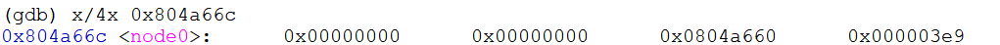
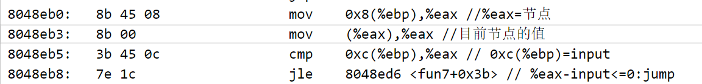

# Bomblab

实验完成时间：2023/4/22-2023/5/2，历时约16个小时  
报告完成时间：2323/5/5  

## phase 1
前三行是phase_1分配栈帧的过程。后面也是类似的过程进行，注意一下即可：  

注意到0x8048b86地址处将内存0x8049948处读入，于是查看这个内存处的内容，发现是下面的字符串：  
  
再结合后面调用了string_not_equal函数，猜测phase_1应该是判断输入的字符串是否和预设字符串相等，于是输入内存给定的字符串，顺利通过。
答案：When I get angry, Mr. Bigglesworth gets upset.

## phase 2
注意到调用了read_six_numbers函数，猜测输入应该是6个数字。  
这里有一个简单的循环，在地址0x8048bc9处将%ebp-0x4设置为1，在地址0x8048bf1处有自增操作，在地址0x8048bf4进行检查，如果这个值<=5，继续循环，否则跳出循环。  
接下来看循环内部的操作：根据一个通项公式判断输入的6个数字是否符合这个规律，最终整理出来的通项公式：
$$
A[1]=1 \\
A[i]=(i+1)*A[i-1], i=2,3,4,5,6
$$

答案：1 2 6 24 120 720

## phase 3
注意到从地址0x8049977处读入内容，查看这里的内容为"%d %d"，又注意到调用了sscanf，猜测本题输入应该是两个整数。   
   
地址0x8048c45处将输入的第一个整数和7进行比较，如果＞7会爆炸，说明我们输入的第一个整数应该<=7。  
0x8048c55处有一个根据输入的第一个整数的情况进行间接跳转，因此这个题实际上是多解的。如果输入的第一个整数是1，那么应该跳转到0x08048c57。  
这里先给出其中一个解：0 790

## phase 4
phase_4：
注意到从地址$0x80499a0处读入内容，查看这里的内容为"%d"，说明本题输入应该是一个整数。    
   
地址0x8048d1f处将输入整数d和0比较，只有＞0继续执行，否则爆炸。    
地址0x8048d2e处调用函数func4，输入参数为d，地址0x8048d36将func4(d)和0x6ff1比较，如果不相等就爆炸。  
接下来分析func4的过程：  
地址0x8048cba处先比较输入参数d和0x1的关系，如果d＞1，return func4(x-1)+func4(x-2)；否则，直接return 1。  
实际上func4(d)就是计算d的斐波那契数的过程！  
因此综合起来来看，输入整数d的斐波那契数应该=0x6ff1=28657  
答案：22  
进入secret phase的答案：22 austinpowers

## phase 5
地址0x8048d52处调用了string_length函数，返回输入的字符串长度，地址0x8048d5a处将字符串长度和6比较，如果不相等就爆炸，说明应该输入长度为6的字符串。  
这里有一个循环：%ebp-0xc初始为0，每次循环自增1，结束条件>5，相当于循环5次。
接下来看循环体，循环核心代码如下：

每一个循环中，从输入字符串的对应位置取出一个整数作为下标，根据这个下标从起始地址为0x804a5c0的数组取出一个整数，将6次循环的整数相加，最后答案应该＝0x34，否则爆炸。  
因此这个题的思路应该是查看存放在0x804a5c0的数组，然后开始凑6个下标，使这6个下标对应的值相加为0x34.所以这个题应该也是多解的，这里只给出一个解。  
查看存放在0x804a5c0的数组：  
  
答案：111122

## phase 6
注意到这里将地址0x804a66c的内容读到-0x8(%ebp)处，先看一下读进来的是什么：

发现是一个链表节点，这个节点占4个字节，注意到第三个字节是一个地址，于是顺着这个地址开始查看，发现一系列节点。根据这一系列节点的内容进行猜测：第一个字节存放节点的值，第二个字节是节点编号，第三个字节是指向下一个节点的指针，最后一个字节是上一个节点的指针。
  
下面这几行代码是将输入的值存放到node0的值，因此这个题的输入应该是一个整数：

下面phase_6调用了fun6，这里先直接说结论：func6的操作是将node0-node9按照值的大小降序连接，返回链表头。  
这里的思路就是先默认node0-1-...-9排序，从node0开始检查，使用插入排序的方法对链表进行排序。插入排序是指在待排序的元素中，假设前面n-1(其中n>=2)个数已经是排好顺序的，现将第n个数插到前面已经排好的序列中，然后找到合适自己的位置，使得插入第n个数的这个序列也是排好顺序的。按照此法对所有元素进行插入，直到整个序列排为有序的过程。  
下面研究fun6的功能，说实话困住了我很久，虽然没有递归调用，但是在fun6内部反复横跳也令我苦恼很久。最后解决方法就是耐心调试，观察了几步之后猜测是链表降序连接，并在后面进行了验证，证明我的结论是正确的。  
fun6返回排好序的头节点之后，phase_6后续的操作是取出链表中第二个节点，用它的值和我们输入的值进行比较，如果不相等就爆炸，因此这道题我们的输入的数应该是整个链表中第二大的数。  
这道题也是一个多解问题，除去我们输入的数，链表节点最大值是node4=0x3e4，链表节点第二大值是node7=0x3d6，只要在这个区间中的数就可以，这里只给出一个可行答案：  
答案：985

## secret phase
到这里其实就可以正确拆除6个phase炸弹了！但是我反汇编代码中发现了secret_phase，在bomb.c中也发现了提示。
  
首先要找到secret phase的入口，直接在反编译代码之中进行搜索！发现phase_defused调用了secret_phase，而每个phase后都调用了phase_defused。首先研究一下如何才能进入secret_phase：  
地址0x804a88c是函数num_input_strings，返回目前已经输入了几个字符串，只有返回6时才可以通过，也就是说必须先解完前6个phase之后才能进入secret_phase。  

地址0x8049e40处存放的是"%d %s"，地址0x8049e46处存放的是字符串"austinpowers"，因此推测进入secret_phase需要在某个只输入一个整数的题后面加上这个字符串，前面6个phase只有phase_4和phase_6符合这个条件。那具体是哪题的判断方法是在这两个题后面加上分开试一试，因为sscanf会返回输入的长度，只有正确的题输入长度为2才可以通过，最后发现要在phase_4答案后面加上一个字符串“austinpowers”即可。  

找到secret_phase的进入方法之后看一下secret_phase到底在干嘛：这一段是判断输入的数的范围，应该在0-0x3e9之间，否则爆炸。 
 
注意这里从地址0x804a720读入了内容，看一下读入了什么：

发现这个地址存放了一个节点，这个节点占用了4个字节，第二个字节和第三个字节是地址，我们顺着这两个地址读一下，发现又是一系列节点，是一个二叉搜索树结构：

可以画出一棵二叉搜索树：  
  
搞清楚结构之后，可以看到secret_phase调用了fun7，将二叉树的根节点作为参数传入，下面看看fun7的功能：  
下面这一段代码将当前节点的值和输入值进行大小不同进行比较，根据比较结果进行跳转，再根据跳转的代码进行分析，其实这就是给定输入值进行二叉搜索树搜索，如果命中了就返回0；如果没有命中但可以进一步搜索就返回2\*fun7(new_node)+1；如果没有命中且不能进一步搜索时，返回0xffffffff。

再回到secret_phase中进行分析，可以看到只有在fun7输出为1时可以通过，否则爆炸。因此回到fun7和二叉搜索树中，发现在输入值为根节点的右孩子时符合输出要求，验证成功，至此顺利拆掉所有炸弹！  
答案：50

## 最终答案

## 一些总结
感觉完成这个lab非常重要的一点是“大胆假设、小心求证”，尤其是有多个循环或递归调用的题目，比如这里的phase_6，是我观察了两个循环之后猜测了结论并在后面的循环进行验证的。  
书上说前7个参数通过寄存器传参，但本题所有参数都是通过压栈来进行传递的，这里有所不同。  
gdb命令参考：http://csapp.cs.cmu.edu/3e/docs/gdbnotes-x86-64.pdf  
如何进入secret phase参考：https://blog.csdn.net/qq_37500516/article/details/120903236