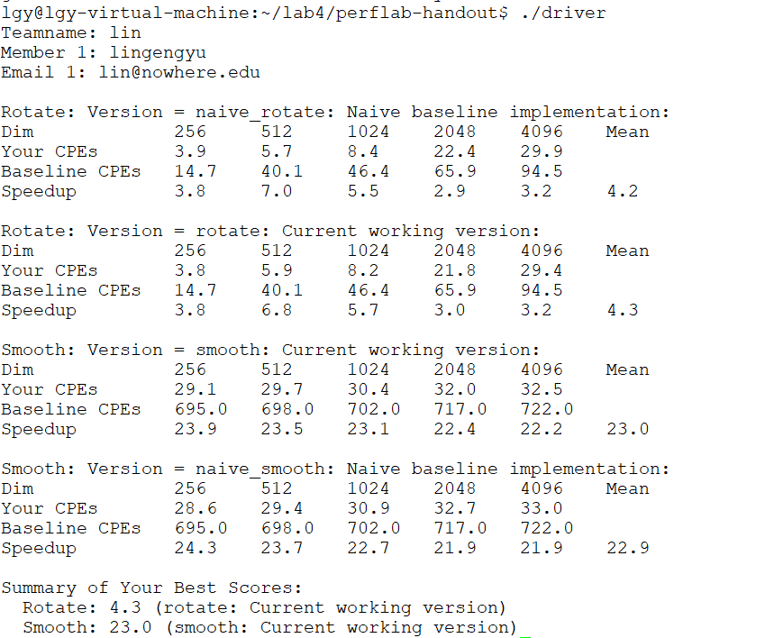
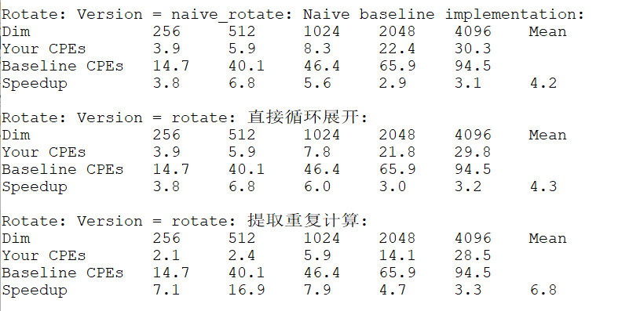
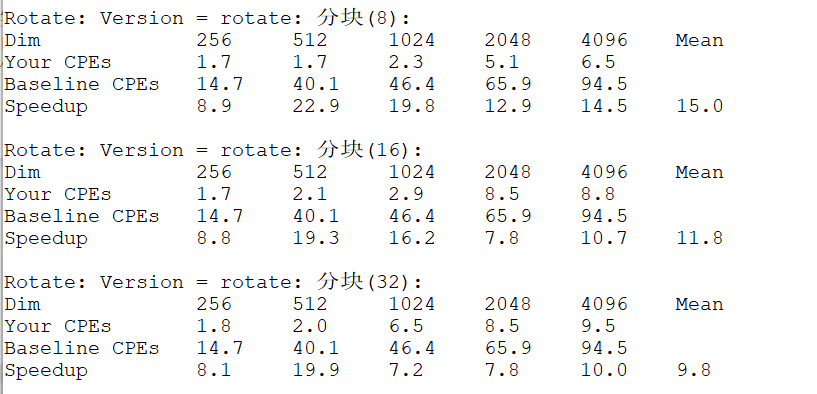
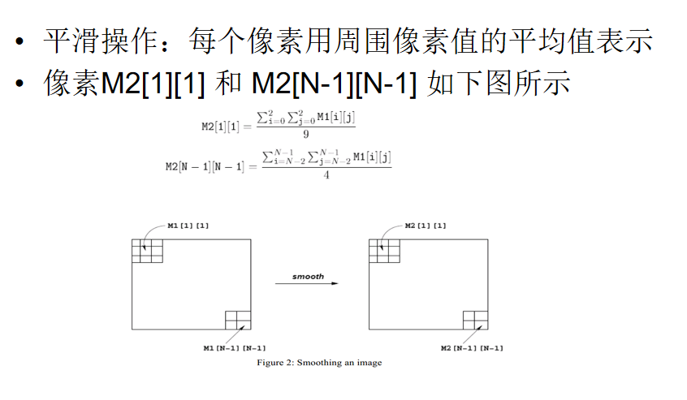
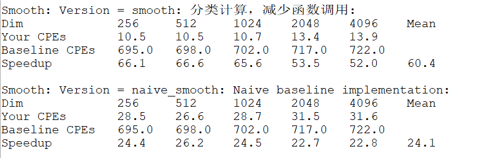

#! https://zhuanlan.zhihu.com/p/631356631
# csapp lab4 performancelab

实验完成时间：2023/5/20-2023/5/21    
实验报告完成时间：2023/5/22


先不对两个函数进行修改，运行一下baseline：（但是要先在kernels.c中修改team结构体，否则会报错）
```
make clean
make driver
./driver
```
  


## 1.Rotate

先看一下lab提供的原始方法：一个非常简单、直观的双层循环，外层循环按行遍历，内层循环按列遍历。  
```c
char naive_rotate_descr[] = "naive_rotate: Naive baseline implementation";
void naive_rotate(int dim, pixel *src, pixel *dst) 
{
    int i, j;

    for (i = 0; i < dim; i++)
	for (j = 0; j < dim; j++)
	    dst[RIDX(dim-1-j, i, dim)] = src[RIDX(i, j, dim)];
}
```


首先试一下课本上提到的两个方法：  

1. 循环展开  
   循环展开的思想是减少迭代次数，提高运行效率。
   ```c
    char rotate_descr[] = "rotate: 直接循环展开";
    void rotate(int dim, pixel *src, pixel *dst) 
    {
        //naive_rotate(dim, src, dst);
        int i, j;
        for (i = 0; i < dim; i++){
            for (j = 0; j < dim; j+=2){
                dst[RIDX(dim-1-j, i, dim)] = src[RIDX(i, j, dim)];
                dst[RIDX(dim-2-j, i, dim)] = src[RIDX(i, j+1, dim)];
            }
        }
        for(;i<dim;i++){
            for(;j<dim;j+=2){
                dst[RIDX(dim-1-j, i, dim)] = src[RIDX(i, j, dim)];
            }
        }
    }
    ```

2. 减少重复计算  
   通过将循环内的重复计算提到循环外，来提高运行效率。  
   ```c
   char rotate_descr2[] = "rotate: 提取重复计算";
    void rotate2(int dim, pixel *src, pixel *dst) 
    {
        //naive_rotate(dim, src, dst);
        int i, j,t;
        for (i = 0; i < dim; i++){
            t=(dim-1-i)*dim;
            for (j = 0; j < dim; j++)
                dst[t+j] = src[RIDX(j, i, dim)];
        }
    }
    ```

看一下这两种方法的提升效果：  
  
从上图可以看出，这两种方法的提升效果非常不明显，这说明这两个方法没能解决性能瓶颈。下面考虑一下分块的方法：

3. 分块  
   分块的核心思想是**提高cache命中率**。  
   将图片简化成一个二维矩阵，矩阵都是按行优先方向存储的，二维矩阵实际作为一维来存储。对于内存循环，按照列来访问，在一维存储上是不连续的。如果不分块处理，在图片尺寸很大的情况下，cache中很可能无法存下一列数据，所以每次访问新一列的时候，都会不命中，导致cache命中率很低。  
   分块大小决定了时间局部性的好坏：分块越小，时间局部性越好。最理想的情况是分的小块可以完全装满cache。  
   由于我们不知道cache的大小，于是就选择分块为8\*8、16\*16、32\*32来分别进行实验，下面给出分块为8\*8时的代码：  
   ```c
   char rotate_descr3[] = "rotate: 分块(8)";
    void rotate3(int dim, pixel *src, pixel *dst) 
    {
        //naive_rotate(dim, src, dst);
        int i, j,ki,kj;
        for (i = 0; i < dim; i+=8) //每块8行
        for (j = 0; j < dim; j+=8) //每块8列
            for(ki=i; ki<i+8; ki++) 
            for(kj=j; kj<j+8; kj++) 
                dst[RIDX(dim-1-kj, ki, dim)] = src[RIDX(ki, kj, dim)];
    }
    ```
    最后看一下实验结果：  
      
    从上图可知，8\*8分块的性能提升最明显。


## 2.Smooth

smooth的图解如下。可以看出，在四个角和边缘的四条边需要特殊处理，而中间的部分可以普通地处理。  
  
看一下lab给的smooth的原始代码：  
```c
/*
 * naive_smooth - The naive baseline version of smooth 
 */
char naive_smooth_descr[] = "naive_smooth: Naive baseline implementation";
void naive_smooth(int dim, pixel *src, pixel *dst) 
{
    int i, j;

    for (i = 0; i < dim; i++)
	for (j = 0; j < dim; j++)
	    dst[RIDX(i, j, dim)] = avg(dim, i, j, src);
}

/* 
 * avg - Returns averaged pixel value at (i,j) 
 */
static pixel avg(int dim, int i, int j, pixel *src) 
{
    int ii, jj;
    pixel_sum sum;
    pixel current_pixel;

    initialize_pixel_sum(&sum);
    for(ii = max(i-1, 0); ii <= min(i+1, dim-1); ii++) 
	for(jj = max(j-1, 0); jj <= min(j+1, dim-1); jj++) 
	    accumulate_sum(&sum, src[RIDX(ii, jj, dim)]);

    assign_sum_to_pixel(&current_pixel, sum);
    return current_pixel;
}
```
看起来非常的精简，但实际上调用了非常多的自定义函数，仅仅是为了解决特殊情况判断。考虑到特殊情况的判断比较简单，可以直接将特殊情况展开写在smooth函数里，通过**减少函数调用**来提高运行性能。  
```c
char smooth_descr[] = "smooth: 分类计算，减少函数调用";
void smooth(int dim, pixel *src, pixel *dst) 
{
    //naive_smooth(dim, src, dst);
    int i, j, t;
    //左上角
    i = 0;
    j = 0;
    dst[0].blue = (src[0].blue + src[1].blue + src[dim].blue + src[dim+1].blue)/4;
    dst[0].green = (src[0].green + src[1].green + src[dim].green + src[dim+1].green)/4;
    dst[0].red = (src[0].red + src[1].red + src[dim].red + src[dim+1].red)/4;
    //右上角
    i = 0;
    j = dim - 1;
    dst[dim-1].blue = (src[RIDX(i, j - 1, dim)].blue + src[RIDX(i, j, dim)].blue + src[RIDX(i + 1, j - 1, dim)].blue + src[RIDX(i + 1, j, dim)].blue)/4;
    dst[dim-1].green = (src[RIDX(i, j - 1, dim)].green + src[RIDX(i, j, dim)].green + src[RIDX(i + 1, j - 1, dim)].green + src[RIDX(i + 1, j, dim)].green)/4;
    dst[dim-1].red = (src[RIDX(i, j - 1, dim)].red + src[RIDX(i, j, dim)].red + src[RIDX(i + 1, j - 1, dim)].red + src[RIDX(i + 1, j, dim)].red)/4;
    //左下角
    i = dim - 1;
    j = 0;
    dst[RIDX(i, j, dim)].blue = (src[RIDX(i - 1, j, dim)].blue + src[RIDX(i - 1, j + 1, dim)].blue + src[RIDX(i, j, dim)].blue + src[RIDX(i, j + 1, dim)].blue)/4;
    dst[RIDX(i, j, dim)].green = (src[RIDX(i - 1, j, dim)].green + src[RIDX(i - 1, j + 1, dim)].green + src[RIDX(i, j, dim)].green + src[RIDX(i, j + 1, dim)].green)/4;
    dst[RIDX(i, j, dim)].red = (src[RIDX(i - 1, j, dim)].red + src[RIDX(i - 1, j + 1, dim)].red + src[RIDX(i, j, dim)].red + src[RIDX(i, j + 1, dim)].red)/4;
    //右下角
    i = dim - 1;
    j = dim - 1;
    dst[RIDX(i, j, dim)].blue = (src[RIDX(i - 1, j - 1, dim)].blue + src[RIDX(i - 1, j, dim)].blue + src[RIDX(i, j -1, dim)].blue + src[RIDX(i, j, dim)].blue)/4;
    dst[RIDX(i, j, dim)].green = (src[RIDX(i - 1, j - 1, dim)].green + src[RIDX(i - 1, j, dim)].green + src[RIDX(i, j -1, dim)].green + src[RIDX(i, j, dim)].green)/4;
    dst[RIDX(i, j, dim)].red = (src[RIDX(i - 1, j - 1, dim)].red + src[RIDX(i - 1, j, dim)].red + src[RIDX(i, j -1, dim)].red + src[RIDX(i, j, dim)].red)/4;
    //上边界
    i = 0;
    for(j = 1; j <= dim - 2; j++){
        dst[j].blue = (src[RIDX(i, j - 1, dim)].blue + src[RIDX(i, j, dim)].blue + src[RIDX(i, j + 1, dim)].blue + src[RIDX(i + 1, j - 1, dim)].blue + src[RIDX(i + 1, j, dim)].blue + src[RIDX(i + 1, j + 1, dim)].blue)/6;
        dst[j].green = (src[RIDX(i, j - 1, dim)].green + src[RIDX(i, j, dim)].green + src[RIDX(i, j + 1, dim)].green + src[RIDX(i + 1, j - 1, dim)].green + src[RIDX(i + 1, j, dim)].green + src[RIDX(i + 1, j + 1, dim)].green)/6;
        dst[j].red = (src[RIDX(i, j - 1, dim)].red + src[RIDX(i, j, dim)].red + src[RIDX(i, j + 1, dim)].red + src[RIDX(i + 1, j - 1, dim)].red + src[RIDX(i + 1, j, dim)].red + src[RIDX(i + 1, j + 1, dim)].red)/6;
    }
    //下边界
    i = dim - 1;
    for (j = 1; j <= dim - 2; j++){
        dst[RIDX(i, j, dim)].blue = (src[RIDX(i-1, j-1, dim)].blue + src[RIDX(i-1, j, dim)].blue + src[RIDX(i - 1, j + 1, dim)].blue + src[RIDX(i, j - 1, dim)].blue + src[RIDX(i, j, dim)].blue + src[RIDX(i, j + 1, dim)].blue)/6;
        dst[RIDX(i, j, dim)].green = (src[RIDX(i-1, j-1, dim)].green + src[RIDX(i-1, j, dim)].green + src[RIDX(i - 1, j + 1, dim)].green + src[RIDX(i, j - 1, dim)].green + src[RIDX(i, j, dim)].green + src[RIDX(i, j + 1, dim)].green)/6;
        dst[RIDX(i, j, dim)].red = (src[RIDX(i-1, j-1, dim)].red + src[RIDX(i-1, j, dim)].red + src[RIDX(i - 1, j + 1, dim)].red + src[RIDX(i, j - 1, dim)].red + src[RIDX(i, j, dim)].red + src[RIDX(i, j + 1, dim)].red)/6;
    }
    //左边界
    j = 0;
    for (i = 1; i <= dim - 2; i++){
        dst[RIDX(i, j, dim)].blue = (src[RIDX(i - 1, j, dim)].blue + src[RIDX(i - 1, j + 1, dim)].blue + src[RIDX(i, j, dim)].blue + src[RIDX(i, j + 1, dim)].blue + src[RIDX(i + 1 , j, dim)].blue + src[RIDX(i + 1, j + 1, dim)].blue)/6;
        dst[RIDX(i, j, dim)].green = (src[RIDX(i - 1, j, dim)].green + src[RIDX(i - 1, j + 1, dim)].green + src[RIDX(i, j, dim)].green + src[RIDX(i, j + 1, dim)].green + src[RIDX(i + 1 , j, dim)].green + src[RIDX(i + 1, j + 1, dim)].green)/6;
        dst[RIDX(i, j, dim)].red = (src[RIDX(i - 1, j, dim)].red + src[RIDX(i - 1, j + 1, dim)].red + src[RIDX(i, j, dim)].red + src[RIDX(i, j + 1, dim)].red + src[RIDX(i + 1 , j, dim)].red + src[RIDX(i + 1, j + 1, dim)].red)/6;
    }
    //右边界
    j = dim - 1;
    for (i = 1; i <= dim - 2; i++){
        dst[RIDX(i, j, dim)].blue = (src[RIDX(i - 1, j - 1, dim)].blue + src[RIDX(i - 1, j, dim)].blue + src[RIDX(i, j - 1, dim)].blue + src[RIDX(i, j, dim)].blue + src[RIDX(i + 1, j - 1, dim)].blue + src[RIDX(i + 1, j, dim)].blue)/6;
        dst[RIDX(i, j, dim)].green = (src[RIDX(i - 1, j - 1, dim)].green + src[RIDX(i - 1, j, dim)].green + src[RIDX(i, j - 1, dim)].green + src[RIDX(i, j, dim)].green + src[RIDX(i + 1, j - 1, dim)].green + src[RIDX(i + 1, j, dim)].green)/6;
        dst[RIDX(i, j, dim)].red = (src[RIDX(i - 1, j - 1, dim)].red + src[RIDX(i - 1, j, dim)].red + src[RIDX(i, j - 1, dim)].red + src[RIDX(i, j, dim)].red + src[RIDX(i + 1, j - 1, dim)].red + src[RIDX(i + 1, j, dim)].red)/6;
    }
    //中心点
    for (i = 1; i <= dim - 2; i++){
        t = i*dim;
        for (j = 1; j <= dim - 2; j++){
            dst[t+j].blue = (src[RIDX(i - 1, j - 1, dim)].blue + src[RIDX(i - 1, j, dim)].blue + src[RIDX(i - 1, j + 1, dim)].blue + src[RIDX(i, j - 1, dim)].blue + src[RIDX(i, j, dim)].blue + src[RIDX(i, j + 1, dim)].blue + src[RIDX(i + 1, j - 1, dim)].blue + src[RIDX(i + 1, j, dim)].blue + src[RIDX(i + 1, j + 1, dim)].blue)/9;
            dst[t+j].green = (src[RIDX(i - 1, j - 1, dim)].green + src[RIDX(i - 1, j, dim)].green + src[RIDX(i - 1, j + 1, dim)].green + src[RIDX(i, j - 1, dim)].green + src[RIDX(i, j, dim)].green + src[RIDX(i, j + 1, dim)].green + src[RIDX(i + 1, j - 1, dim)].green + src[RIDX(i + 1, j, dim)].green + src[RIDX(i + 1, j + 1, dim)].green)/9;
            dst[t+j].red = (src[RIDX(i - 1, j - 1, dim)].red + src[RIDX(i - 1, j, dim)].red + src[RIDX(i - 1, j + 1, dim)].red + src[RIDX(i, j - 1, dim)].red + src[RIDX(i, j, dim)].red + src[RIDX(i, j + 1, dim)].red + src[RIDX(i + 1, j - 1, dim)].red + src[RIDX(i + 1, j, dim)].red + src[RIDX(i + 1, j + 1, dim)].red)/9;
        }
    }
}
```

实验结果如下图所示，减少函数调用后，可以看出性能有非常明显的提升。  
